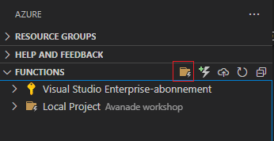
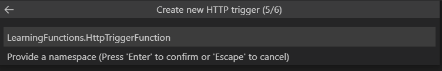

# Azure Functions Workshop


Welcome to this Azure Functions workshop. You will be solving three tasks that will 
guide you in developing Azure Functions with HTTP trigger, Cosmos DB trigger and a timer trigger.


## Prerequisites

1. An active Azure account. Create a [free account](https://docs.microsoft.com/en-us/learn/modules/create-an-azure-account/2-azu)
2. [Azure Functions Core](https://docs.microsoft.com/en-us/azure/azure-functions/functions-run-local?tabs=windows%2Ccsharp%2Cportal%2Cbash%2Ckeda​)
3. [Visual Studio Code](https://code.visualstudio.com/)
4. [Azure Functions extension for VS Code](https://marketplace.visualstudio.com/items?itemName=ms-azuretools.vscode-azurefunctions)


We recommend that a folder is created to contain all of the function created in the workshop.


## Setting up a development environment

1. Create a folder that will contain all of the functions created in the workshop
e.g. `Avanade Functions Workshop`
2. Open Visual Studio code and open the newly created folder by selecting `Open folder` in the `File` menu.

Congratulations, you are now ready to start developing your first Azure functions!

## Task 1 - Creating an Azure Function with an HTTP trigger

### Create an Azure Functions project

The Azure Functions extension in VS Code lets you create a function app project, along with your first function. 

1. From Azure: Functions, select the Create Project icon: 

    

You will now be prompted for configurations for the project. Input the following values:

- **Folder that will contain your project**: The folder you newly created.

- **Language**: C#

    

- **.NET runtime**: .NET 5

    

- **Template for first function**: HTTP trigger

    

- **Function name**: HttpTriggerFunction

    

- **Namespace**: Workshop.HttpTriggerFunction

    

- **Access rights**: Anonymous

   

Your project and first function is now being set up and a number of files will be created in the folder. 

### The project files

Your workshop folder should be looking like this


A number of files are generated, for the most part we will leave them as is, but there are two files we will be working with. 

- `local.settings.json` holds the settings for running the function locally and we will be updating this later in the workshop. 

- `HttpTriggerFunction.cs` contains the function.

```cs
[Function("HttpTriggerFunction")]
public static HttpResponseData Run([HttpTrigger(AuthorizationLevel.Anonymous,"get", "post")] HttpRequestData req,
    FunctionContext executionContext)
{
    var logger = executionContext.GetLogger("HttpTriggerFunction");
    logger.LogInformation("C# HTTP trigger function processed a request.");
    var response = req.CreateResponse(HttpStatusCode.OK);
    response.Headers.Add("Content-Type", "text/plain; charset=utf-8");
    response.WriteString("Welcome to Azure Functions!");
    return response;
}
```


The function an attribute `[Function("HttpTriggerFunction")]` that specifies that this is an Azure Function and that it reacts to an `http trigger`. 

The function supports both `HTTP GET` and `HTTP POST` requests, and the input is an `HttpRequestData` object and a `FuncionContext` object.

Each time the function is triggered, a text string is written to the console and a text string is returned to the client.

**Question**

Which text string will appear in the console and which text string will appear in the browser? Not quite sure? Go on to the next step to find out!


### Run the template project
The auto created function is ready to run as is, let's test that everything is set up ok. 

1. Open a new terminal in VS Code 
2. Navigate to the project folder and run cmd `func start`

If everything is successful the output in the terminal should look like this

   

Navigate to the url displayed in the terminal to see your function.


### Modifying the HTTP trigger function

Run the cmd `func start` after each step to see the results.

1. Hard coded response.

    Change the text in the response from `Welcome to Azure Functions!` 
to `Hi, [insert name]. Welcome to my first Azure Function.`

    [Code hint](https://github.com/acn-sbuad/avanade-workshop/tree/main/hints/HttpTriggerFunction/ModifyHttpTrigger/hardcodedResponse)

2. Returing dynamic data

    Instead of printing a hard coded string, can you make the function return the current time? 

    _Hint_: In C#, the DateTime object is defined in the `System` namespace.

    [Code hint](https://github.com/acn-sbuad/avanade-workshop/tree/main/hints/HttpTriggerFunction/ModifyHttpTrigger/dynamicResponse)    

3. Accesing query parameters

    To access a query parameter passed to the function use the following code snippets to the file.

    ```cs
    using System.Web;
    ```

    ```cs
    var query = HttpUtility.ParseQueryString(req.Url.Query);
    string parameterValue = query["parameterName"];
    ```

    Knowing this, are you able to use the parameter value in the response returned to the user? 

    _Hint_: To send a query parameter to the function add `?{parameterName}={parameterValue}` at the end of the url. E.g. `http://localhost:7071/api/HttpTriggerFunction?company=Avanade`

    [Code hint](https://github.com/acn-sbuad/avanade-workshop/tree/main/hints/HttpTriggerFunction/ModifyHttpTrigger/accessQueryParam)    

## Task 2 - Creating an Azure Function with a Cosmos DB trigger

In this and future tasks, you will be working with a [website for rating pizza](https://pizzaranker.z1.web.core.windows.net/), and our function will be triggered based on actions on this page. 

The site collects ratings for various pizzas and users can give a score from 0 to 4. The ratings are stored in an Azure Cosmos DB.

    


Your task will be to create an Azure Function that is triggered each time a new rating is given on the site.

For the purpose of this workshop, each instance of the site stores the ratings in a seperate collection in Cosmos DB. This way, you can test you function by adding a rating to the site, and it only triggering your function.

Your individual resources will all be identified by using the GUID displayed in the top right corner of the website.

    


### Create a new Azure Function

The Azure Functions extension in VS Code lets you create a function. 

From Azure: Functions, select the Create Function icon: 

    

You will now be prompted for configurations for the project and login to Azure. Input the following values:
- **Template for function**: Azure Cosmos DB trigger

- **Function name**: CosmosTriggerFunction


- **Namespace**: Workshop.HttpTriggerFunction

- **Settings from `local.settings.json`**: + Create new local app setting and Skip for now

- **Select subscription**: Select your available subscription.

- **Select database account**: Skip for now

- **Database name**: storage

- **Colletion name**: ratings_[GUID] e.g. `ratings_88a3175c-310a-45b4-920d-c0576f617e5d`

- **Storage account prompt**: Use local emulator

    

Your function is now being set up and a file `CosmosTriggerFunction.cs` will be added to your folder.

### Complete setup of function

1. Set connection string in `local.settings.json`

    Open file add a new setting to the `Values` section

    ```json
    CosmosConnection: "AccountEndpoint=https://abakus-workshop.documents.azure.com:443/;AccountKey=XnSfxZw1Npwzw5oDg1OvIDzBpX8h9KirkDLTsghy7myFCyW3YmOdyVIIyB0bINwmQju0UxIE6aN7C8CKhNK05w==;"
    ```

2. Complete the trigger configuration in `CosmosTriggerFunction.cs`

    The `Run` function has a configuration for the Cosmos DB trigger,
    but it is not yet complete. 

    ```cs
    [CosmosDBTrigger(
            databaseName: "storage",
            collectionName: "ratings_[GUID]",
            ConnectionStringSetting = "",
            LeaseCollectionName = "leases")]
    ```

    - Ensure that database name is set to `storage`, and that the collection name is set to `ratings_[GUID]`.

    - The value of `ConnectionStringSetting` should be `"CosmosConnection"`. This refers to the value that was included in local.settings.json

    - Change  the value of `LeaseCollectionName` from _leases_ to `"leases_[GUID]"`

    The fully configured attribute should look like this
    
    ```cs
    [CosmosDBTrigger(
            databaseName: "storage",
            collectionName: "ratings_88a3175c-310a-45b4-920d-c0576f617e5d",
            ConnectionStringSetting = "CosmosConnection",
            LeaseCollectionName = "leases_88a3175c-310a-45b4-920d-c0576f617e5d")]
    ```
   

3. Add rating model class to be used by the function

    In `CosmosTriggerFunction.cs`, replace the class `MyDocument` with the model for rating

    ```cs
    public class Rating
    {
        public Guid Id { get; set; }

        public int PizzaId { get; set; }

        public int Score { get; set; }

        public DateTime Created { get; set; }
    }
    ```

    and change type for input from `IReadOnlyList<MyDocument>` to `IReadOnlyList<Rating>` 

4. Run the function
    Your function should now be ready to go and you can run it by typing the cmd `func start` in the terminal.

    Each time a rating is given on the web site, you should see activity in your console.

**Question**

The template function only accesses the first element in the input collection. In what cases would the collection hold more than one element?

### Modify Cosmos DB Trigger function

1. Ensure that all changes to the ratings results in a log line in the console. 
  
    _Hint_: Try looping through the input collection with a _ForEach_ loop.

    [Code hint](https://github.com/acn-sbuad/avanade-workshop/tree/main/hints/CosmosDbTriggerFunction/ModifyCosmosDbFunction/logAllChanges)    

2. Print the content of the rating in the console. 

    To convert the input object to a rating element by casting it.
    
    ```cs
    Rating r = (Rating) input[i];
    ```

    _Hint_: Use System.Text.Json.JsonSerializer to serialize the rating object to a json string.

    [Code hint](https://github.com/acn-sbuad/avanade-workshop/tree/main/hints/CosmosDbTriggerFunction/ModifyCosmosDbFunction/printContent)    
    
3. Print a different string to the console depending of the score of the rating. 

    _Hint_: Use a switch case.

  [Code hint](https://github.com/acn-sbuad/avanade-workshop/tree/main/hints/CosmosDbTriggerFunction/ModifyCosmosDbFunction/printStringBasedOnScore)    


## Task 3 - Creating an Azure Function with a timer trigger

### Setup trigger

1. Using the same project as previous steps: navigate to the Azure functions extension and click the "Create new function.." button


1. When propted for configurations enter:

    Template for function:  **TimerTrigger**

    Name: **ScheduledJob**

    Namespace: **Workshop.TimerTrigger**

    Cron Expression (every 5 minute): **0 */5 * * * ***

2. If promted to create a storage account when debugging, click "**use local emulator**"

The timer trigger is now genereated in your soultion folder in "ScheduledJob.cs": 

```csharp
[Function("ScheduledJob")]
public static void Run([TimerTrigger("0 */5 * * * *")] MyInfo myTimer, FunctionContext context)
{
    var logger = context.GetLogger("ScheduledJob");
    logger.LogInformation($"C# Timer trigger function executed at: {DateTime.Now}");
    logger.LogInformation($"Next timer schedule at: {myTimer.ScheduleStatus.Next}");
}
```

### Testing TimerTrigger

To test the function, run `func start` from cmd / terminal in the solution folder. The output should 

### Code to get summary from api:

```csharp
[FunctionName("ScheduledJob")]
public static async Task Run([TimerTrigger("0 */5 * * * *")]TimerInfo myTimer, ILogger log)
{
    var endpoint = "https://ava-abakus-pizza-rating.azurewebsites.net/ratings/{sessionCode}";
    var httpClient = new HttpClient();
    var result = await httpClient.GetStringAsync(endpoint + "?min=5");

    log.LogInformation($"Result: {result}");
}
```

(Replace {sessionCode} in the endpoint variable with your session code from [https://pizzaranker.z1.web.core.windows.net/](https://pizzaranker.z1.web.core.windows.net/))

### Modify timer function

5 minutes is a long time to wait for your function to trigger. Are you abel to modify the cron job to trigger every 5 second?

## Task 4 - Deploying the functions to Azure


When promted to configure your function select:

1. **Create new functin app in Azure..**
2. Name: **Pick a globally unique name**
3. Runtime stack: **.NET 5(non-LTS)**
4. Location: **Norway East**

Once the deployement is done you should be able see your newly created function app in the [azure portal](https://portal.azure.com/#blade/HubsExtension/BrowseResource/resourceType/Microsoft.Web%2Fsites/kind/functionapp).

### Trigger functions / logs in Azure portals

In order to trigger a function navigate to the trigger:


Then click "Test / run"

From the "Code + Test" view you can trigger functions (1) and see live logs(2).

