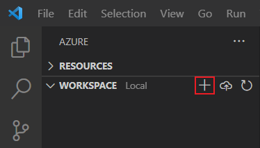
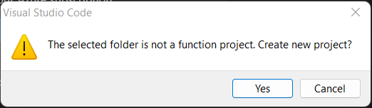
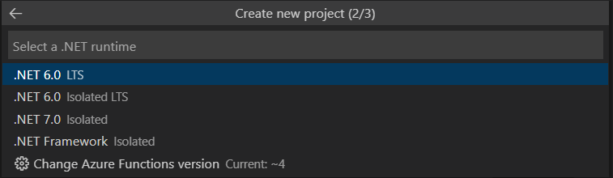
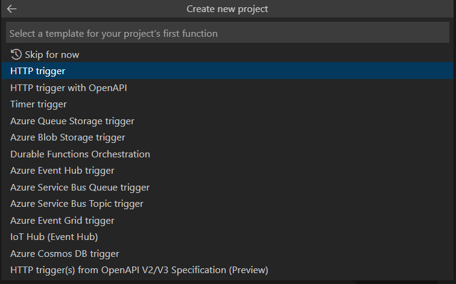
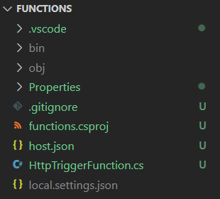
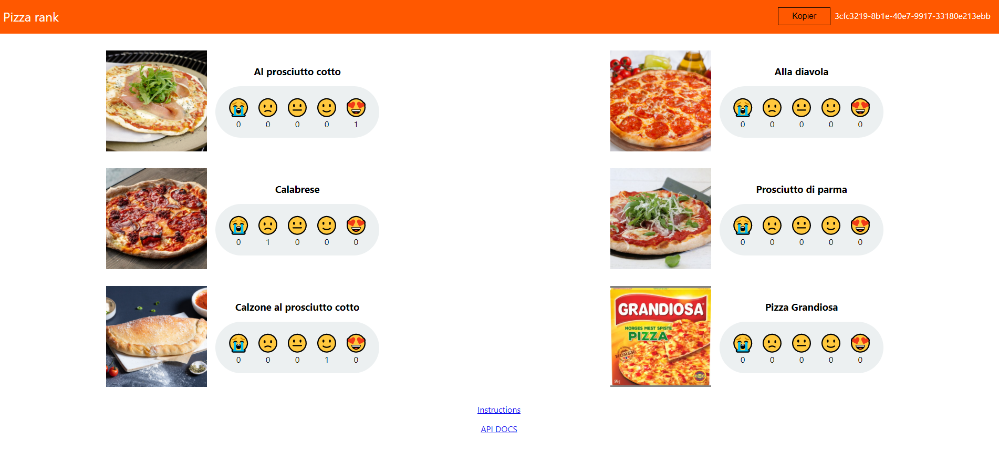
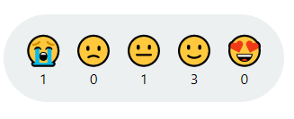
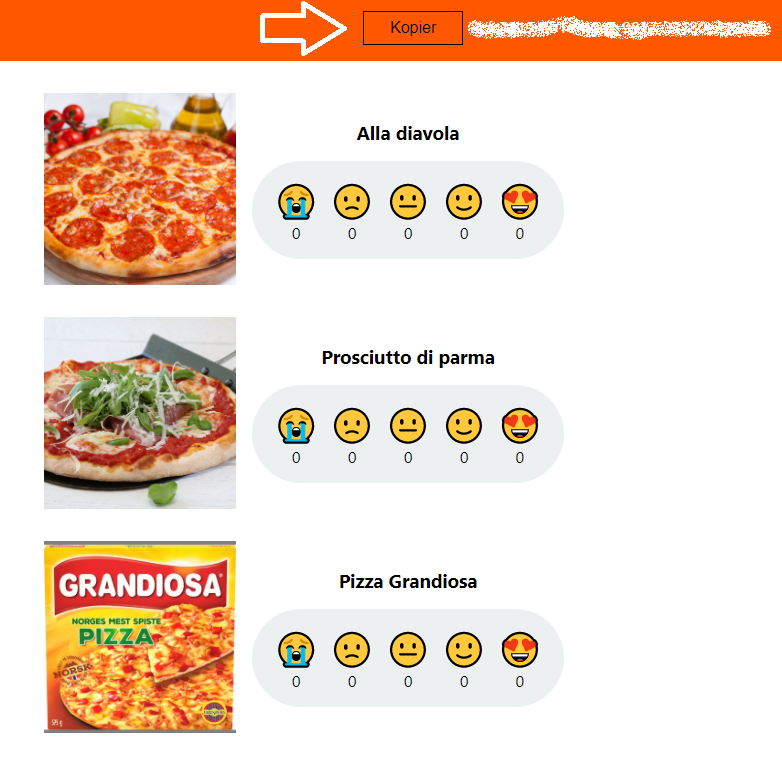
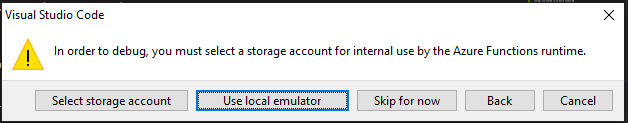

# Azure Functions Workshop


Welcome to this Azure Functions workshop. You will be solving three tasks that will 
guide you in developing Azure Functions with HTTP trigger, Cosmos DB trigger and a timer trigger.


## Task 1 - Creating an Azure Function with an HTTP trigger

### Set up the Azure Function App
The Azure Functions extension in VS Code lets you create a function app project, along with your first function.

1. In VS Code, under the `Workspace` section of the Azure extension, select `Add` and `Create Function`.

    


2. You will now be given the option of creating a function project, select yes. 



Going forward you will not be prompted for configurations for the project. Input the following values:

- **Language**: C#

    

- **.NET runtime**: .NET 6 (LTS)
    

- **Template for first function**: HTTP trigger

    

- **Function name**: HttpTriggerFunction

    

- **Namespace**: LearningFunctions.HttpTriggerFunction

    

- **Access rights**: Anonymous

   

Your project and first function is now being set up and a number of files will be created in the folder. 


### The project files

Your workshop folder should look like this



A number of files are generated, for the most part they will be left as is, but there are two files you will need to edit. 

- `local.settings.json` holds the settings for running the function locally and you will be updating this later in the workshop. 

- `HttpTriggerFunction.cs` contains the function.

```cs
[FunctionName("HttpTriggerFunction")]
public static async Task<IActionResult> Run(
    [HttpTrigger(AuthorizationLevel.Anonymous, "get", "post", Route = null)] HttpRequest req,
    ILogger log)
{
    log.LogInformation("C# HTTP trigger function processed a request.");
    string name = req.Query["name"];
    string requestBody = await new StreamReader(req.Body).ReadToEndAsync();
    dynamic data = JsonConvert.DeserializeObject(requestBody);
    name = name ?? data?.name;
    string responseMessage = string.IsNullOrEmpty(name)
        ? "This HTTP triggered function executed successfully. Pass a name in the query string or in the request body for a personalized response."
        : $"Hello, {name}. This HTTP triggered function executed successfully.";
    return new OkObjectResult(responseMessage);
}
```


The functions first input parameter has an attribute `[HttpTrigger(...)]` that specifies that the function response to an `http trigger`.

The function supports both `HTTP GET` and `HTTP POST` requests, no authorization is required and no route is defined. 
The input is an `HttpRequest` object and an `ILogger` object.

Each time the function is triggered, a text string is written to the console and a text string is returned to the client.

**Question**

Which text string will appear in the console and which text string will appear in the browser? 

Not quite sure? Go on to the next step to find out!


### Run the template project
The auto created function is ready to run as is, let's test that everything is set up ok. 

1. Open a new terminal in VS Code 
2. Navigate to the project folder and run cmd `func start`

If everything is successful the output in the terminal should look like this

   

Navigate to the url displayed in the terminal to see your function.


### Modifying the HTTP trigger function

Run the cmd `func start` after each step to see the results.

1. Hard coded response.

    In the case no name is passed to the function, change the text in the response from 
    `This HTTP triggered function executed successfully. Pass a name in the query string or in the request body for a personalized response.` 
    to `Welcome to my first Azure Function!`

    [Code hint](https://github.com/acn-sbuad/avanade-workshop/tree/main/hints/HttpTriggerFunction/ModifyHttpTrigger/hardcodedResponse)

2. Accessing query parameters

    The function template retrieves a single query parameter _name_. 
    Can you extend the function to process two query parameters `name` and `company`? 
    
    Use the parameters to print a response to the user in the following format:
    
    `Hello, [name]. Are you ready for this workshop with [company]?`

    _Hint_: To send a query parameter to the function add `?{parameterName}={parameterValue}` at the end of the url. E.g. `http://localhost:7071/api/HttpTriggerFunction?company=Avanade` If you want to send multiple parameters separate them with `&`.

    [Code hint](https://github.com/acn-sbuad/avanade-workshop/tree/main/hints/HttpTriggerFunction/ModifyHttpTrigger/accessQueryParam)    

3. Returning dynamic data

    Instead of printing a hard coded string, can you make the function return the current time? 

    _Hint_: In C#, the DateTime object is defined in the `System` namespace. To get the current date use `System.DateTime.Now`.

    [Code hint](https://github.com/acn-sbuad/avanade-workshop/tree/main/hints/HttpTriggerFunction/ModifyHttpTrigger/dynamicResponse)    


**Question**
During the configuration of the function we set the access rights to `anonymous`.
Other available options are `Function` and `Admin` when would you use these two configurations? 

## Task 2 - Creating an Azure Function with a Cosmos DB trigger

In this and future tasks, you will be working with a [website for rating pizza](https://pizzaapp.z1.web.core.windows.net/). The site collects ratings for various pizzas and users can give a score from 0 to 4. The ratings are stored in an Azure Cosmos DB. Cosmos DB is a fully managed NoSQL database for modern app development.

    


    


Your task will be to create an Azure Function that is triggered each time a new rating is given on the site. This can be done using a Azure function with a Cosmos DB trigger.

For the purpose of this workshop, each instance of the site stores the ratings in a separate collection in Cosmos DB. This way, you can test you function by adding a rating to the site, and it only triggers your function.

Your individual resources will be identified by using the GUID displayed in the top right corner of the website. 

    

Keep this GUID handy and insert it everywhere in the description where `[INSERT GUID]` is mentioned.

### Create a new Azure Function

1. In VS Code, under the `Workspace` section of the Azure extension, select `Add` and `Create Function`.


You will now be prompted for configurations for the project and login to Azure. Input the following values:

[TODO: go through steps and confirm what needs to be selected]
[Note: Could we have a file ready for them where they only need to replace certain parts of the code? ]
- **Template for function**: Azure Cosmos DB trigger

- **Function name**: CosmosTriggerFunction

- **Namespace**: LearningFunctions.CosmosTriggerFunction

- **Insert info about storage**;

- **Settings from `local.settings.json`**: + Create new local app setting and Skip for now

- **Select subscription**: Select your available subscription.

- **Select database account**: Skip for now

- **Database name**: storage

- **Collection name**: ratings_[INSERT GUID] e.g. `ratings_88a3175c-310a-45b4-920d-c0576f617e5d`

- **Storage account prompt**: Use local emulator

    

Your function is now being set up and a file `CosmosTriggerFunction.cs` will be added to your folder.

### Complete setup of function

1. Set connection string in `local.settings.json`

    Open file add a new setting to the `Values` section

    ```json
    "CosmosConnection": "AccountEndpoint=https://abakus-workshop.documents.azure.com:443/;AccountKey=XnSfxZw1Npwzw5oDg1OvIDzBpX8h9KirkDLTsghy7myFCyW3YmOdyVIIyB0bINwmQju0UxIE6aN7C8CKhNK05w==;"
    ```

2. Complete the trigger configuration in `CosmosTriggerFunction.cs`

    The `Run` function has a configuration for the Cosmos DB trigger,
    but it is not yet complete. 

    ```cs
    [CosmosDBTrigger(
            databaseName: "storage",
            collectionName: "ratings_[INSERT GUID]", // insert your guid here
            ConnectionStringSetting = "",
            LeaseCollectionName = "leases")]
    ```

    - Ensure that database name is set to `storage`, and that the collection name is set to `ratings_[GUID]`.

    - The value of `ConnectionStringSetting` should be `"CosmosConnection"`. This refers to the value that was included in local.settings.json

    - Change  the value of `LeaseCollectionName` from _leases_ to `"leases_[GUID]"` Remember to insert your custom guid.

    The fully configured attribute should look like this
    "
    ```cs
    [CosmosDBTrigger(
            databaseName: "storage",
            collectionName: "ratings_88a3175c-310a-45b4-920d-c0576f617e5d",
            ConnectionStringSetting = "CosmosConnection",
            LeaseCollectionName = "leases_88a3175c-310a-45b4-920d-c0576f617e5d")]
    ```
   

3. Add rating model class to be used by the function

    In `CosmosTriggerFunction.cs`, replace the class `MyDocument` with the model for rating

    ```cs
    public class Rating
    {
        public Guid Id { get; set; }

        public int PizzaId { get; set; }

        public int Score { get; set; }

        public DateTime Created { get; set; }
    }
    ```

    and change type for input from `IReadOnlyList<MyDocument>` to `IReadOnlyList<Rating>` 

4. Run the function

    Your function should now be ready to go and you can run it by typing the cmd `func start` in the terminal.

    Each time a rating is given on the web site, you should see activity in your console.

**Question**

The template function only accesses the first element in the input collection. In what cases would the collection hold more than one element?

### Modify Cosmos DB Trigger function

1. Ensure that all changes to the ratings results in a log line in the console. 
  
    _Hint_: Try looping through the input collection with a _ForEach_ loop.

    [Code hint](https://github.com/acn-sbuad/avanade-workshop/tree/main/hints/CosmosDbTriggerFunction/ModifyCosmosDbFunction/logAllChanges)    

2. Print the content of the rating in the console. 

    To convert the input object to a rating element by casting it.
    
    ```cs
    Rating r = (Rating) input[i];
    ```

    _Hint_: Use System.Text.Json.JsonSerializer to serialize the rating object to a json string.

    [Code hint](https://github.com/acn-sbuad/avanade-workshop/tree/main/hints/CosmosDbTriggerFunction/ModifyCosmosDbFunction/printContent)    
    
3. Print a different string to the console depending of the score of the rating. 

    _Hint_: Use a switch case.

  [Code hint](https://github.com/acn-sbuad/avanade-workshop/tree/main/hints/CosmosDbTriggerFunction/ModifyCosmosDbFunction/printStringBasedOnScore)    


## Task 3 - Creating an Azure Function with a timer trigger
Another use case for Azure Functions is when you have a job that needs to run on a schedule. Once a week, once a month og even once every five minutes. In this task, you are to create a function that prints a summary of the ratings on the pizza site every 5 minute.

### Setup trigger

1. Using the same project as previous steps: navigate to the Azure functions extension and click the "Create new function.." button


1. When prompted for configurations enter:

    Template for function:  **TimerTrigger**

    Name: **ScheduledJob**

    Namespace: **LearningFunctions.TimerTrigger**

    Cron Expression (every 5 minute): __0 */5 * * * *__

2. If prompted to create a storage account when debugging, click "**use local emulator**"

The timer trigger is now generated in your solution folder in "ScheduledJob.cs": 

```csharp
[Function("ScheduledJob")]
public static void Run([TimerTrigger("0 */5 * * * *")] MyInfo myTimer, FunctionContext context)
{
    var logger = context.GetLogger("ScheduledJob");
    logger.LogInformation($"C# Timer trigger function executed at: {DateTime.Now}");
    logger.LogInformation($"Next timer schedule at: {myTimer.ScheduleStatus.Next}");
}
```

### Testing TimerTrigger

To test the function, run `func start` from cmd / terminal in the solution folder. The output should 

### Code to get summary from api:

```csharp
[FunctionName("ScheduledJob")]
public static async Task Run([TimerTrigger("0 */5 * * * *")]TimerInfo myTimer, ILogger log)
{
    var endpoint = "https://apipizza.azurewebsites.net/ratings/ab2a204f-c5f1-424b-85e2-d8d7ac4730cc";
    var httpClient = new HttpClient();
    var result = await httpClient.GetStringAsync(endpoint + "?min=5");

    log.LogInformation($"Result: {result}");
}
```

(Replace {sessionCode} in the endpoint variable with your session code from [https://pizzaapp.z1.web.core.windows.net/](https://pizzaapp.z1.web.core.windows.net//))

### Modify timer function

5 minutes is a long time to wait for your function to trigger. Are you abel to modify the cron job to trigger every 5 second?

## Task 4 - Deploying the functions to Azure
Until now you have been running the functions locally. This step describes how deploy the function to Azure.


When prompted to configure your function select:

1. **Create new function app in Azure..**
2. Name: **Pick a globally unique name**
3. Runtime stack: **.NET 6**
4. Location: **Norway East**


Once the creation process is complete you should be able see your newly created function app in the [azure portal](https://portal.azure.com/#blade/HubsExtension/BrowseResource/resourceType/Microsoft.Web%2Fsites/kind/functionapp).

**Deploy the code to your newly created function app**


### Trigger functions / logs in Azure portals

In order to trigger a function navigate to the trigger:


Then click "Code + Test"

From the "Code + Test" view you can trigger functions (1) and see live logs(2).

