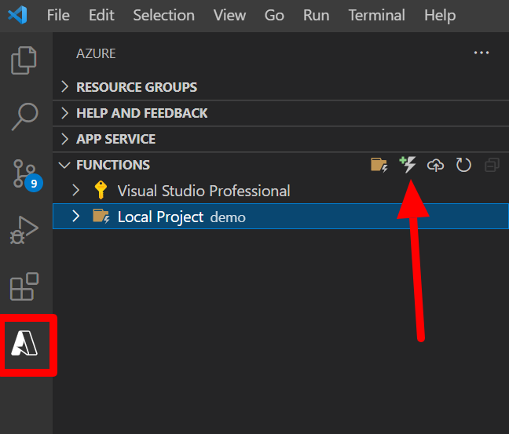
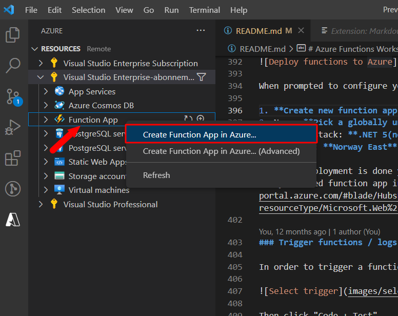
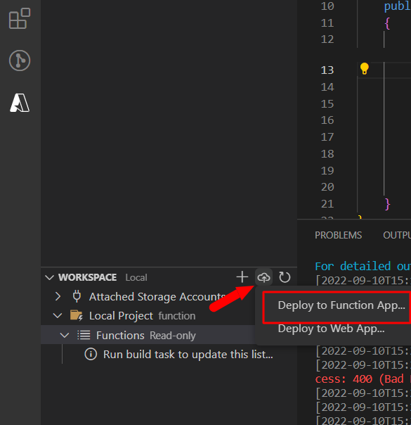
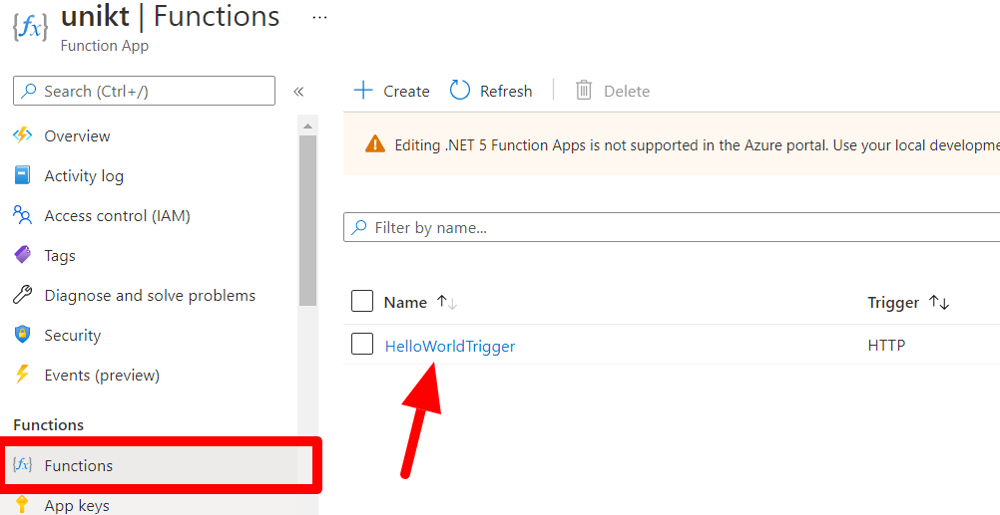
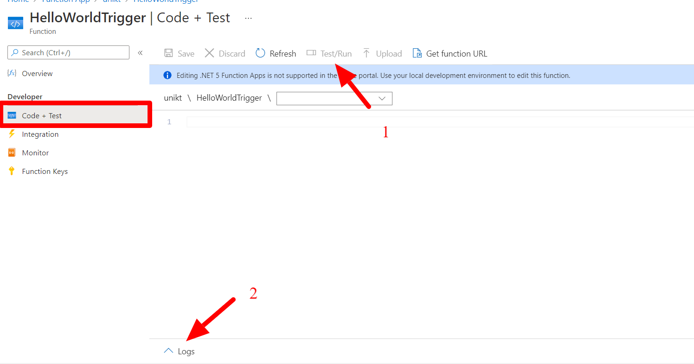

## Creating an Azure Function with a timer trigger
Another use case for Azure Functions is when you have a job that needs to run on a schedule. Once a week, once a month og even once every five minutes. In this task, you are to create a function that prints a summary of the ratings on the pizza site every 5 minute.

### Setup trigger

1. Using the same project as previous steps: navigate to the Azure functions extension and click the "Create new function.." button



1. When prompted for configurations enter:

    Template for function:  **TimerTrigger**

    Name: **ScheduledJob**

    Namespace: **LearningFunctions.TimerTrigger**

    Cron Expression (every 5 minute): __0 */5 * * * *__

2. If prompted to create a storage account when debugging, click "**use local emulator**"

The timer trigger is now generated in your solution folder in "ScheduledJob.cs": 

```csharp
[Function("ScheduledJob")]
public static void Run([TimerTrigger("0 */5 * * * *")] MyInfo myTimer, FunctionContext context)
{
    var logger = context.GetLogger("ScheduledJob");
    logger.LogInformation($"C# Timer trigger function executed at: {DateTime.Now}");
    logger.LogInformation($"Next timer schedule at: {myTimer.ScheduleStatus.Next}");
}
```

### Testing TimerTrigger

To test the function, run `func start` from cmd / terminal in the solution folder. The output should 

### Code to get summary from api:

```csharp
[FunctionName("ScheduledJob")]
public static async Task Run([TimerTrigger("0 */5 * * * *")]TimerInfo myTimer, ILogger log)
{
    var endpoint = "https://apipizza.azurewebsites.net/ratings/ab2a204f-c5f1-424b-85e2-d8d7ac4730cc";
    var httpClient = new HttpClient();
    var result = await httpClient.GetStringAsync(endpoint + "?min=5");

    log.LogInformation($"Result: {result}");
}
```

(Replace {sessionCode} in the endpoint variable with your session code from [https://pizzaapp.z1.web.core.windows.net/](https://pizzaapp.z1.web.core.windows.net//))

### Modify timer function

5 minutes is a long time to wait for your function to trigger. Are you abel to modify the cron job to trigger every 5 second?

## Task 4 - Deploying the functions to Azure
Until now you have been running the functions locally. This step describes how deploy the function to Azure.



When prompted to configure your function select:

1. **Create new function app in Azure..**
2. Name: **Pick a globally unique name**
3. Runtime stack: **.NET 6**
4. Location: **Norway East**


Once the creation process is complete you should be able see your newly created function app in the [azure portal](https://portal.azure.com/#blade/HubsExtension/BrowseResource/resourceType/Microsoft.Web%2Fsites/kind/functionapp).

**Deploy the code to your newly created function app**



### Trigger functions / logs in Azure portals

In order to trigger a function navigate to the trigger:



Then click "Code + Test"

From the "Code + Test" view you can trigger functions (1) and see live logs(2).

