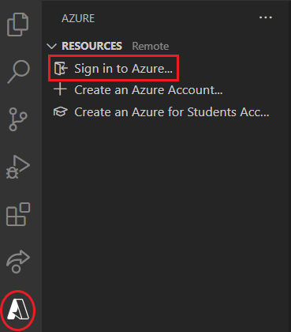
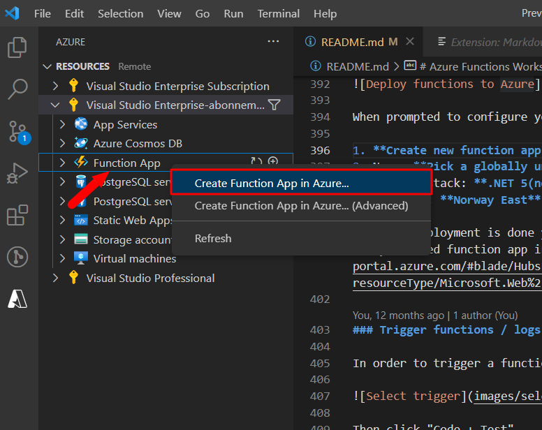
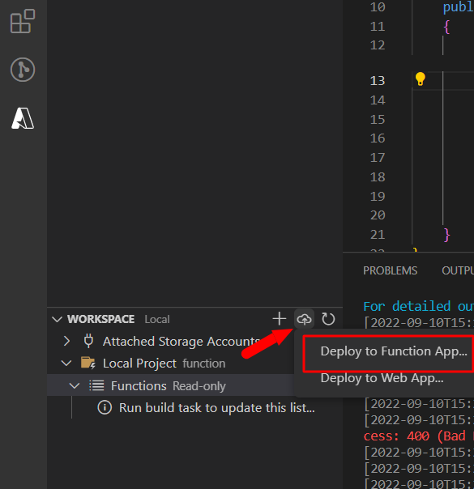
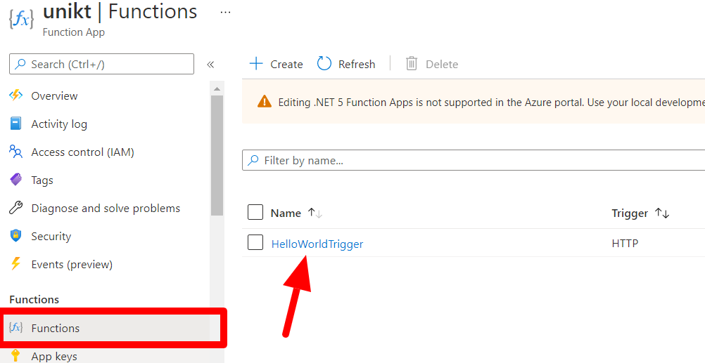
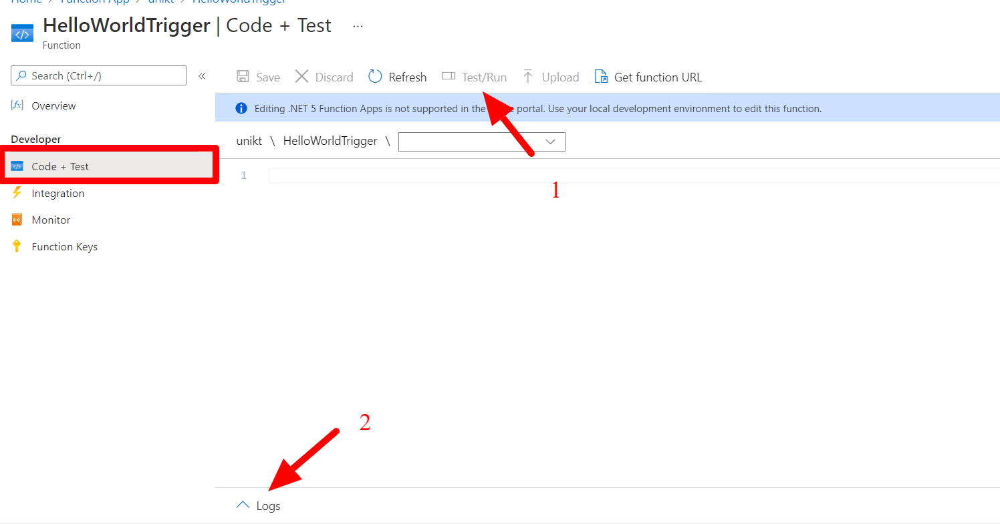

## Setting up a development environment

1. Create a folder that will contain all of the functions created in the workshop
e.g. `learning-functions`
2. Open Visual Studio Code and open the newly created folder by selecting `Open folder` in the `File` menu.

We will now be connecting VS Code to your Azure Account
    
3. In the side menu select the Azure icon and click `Sign in to Azure...` in the `Resources` section. 

Follow the instructions to sign in to your account.

Congratulations, you are now ready to start developing your first Azure functions!

## Deploying the functions to Azure
Until now you have been running the functions locally. This step describes how deploy the function to Azure.

When prompted to configure your function select:

1. **Create new function app in Azure..**
2. Name: **Pick a globally unique name**
3. Runtime stack: **.NET 6**
4. Location: **Norway East**

Once the creation process is complete you should be able see your newly created function app in the [azure portal](https://portal.azure.com/#blade/HubsExtension/BrowseResource/resourceType/Microsoft.Web%2Fsites/kind/functionapp).

**Deploy the code to your newly created function app**

### Trigger functions / logs in Azure portals

In order to trigger a function navigate to the trigger:

Then click "Code + Test"

From the "Code + Test" view you can trigger functions (1) and see live logs(2).

